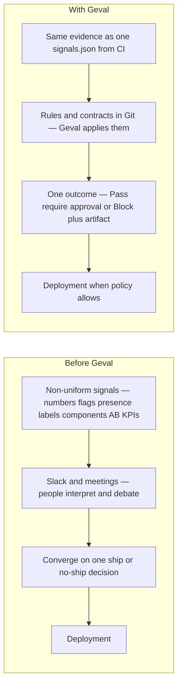
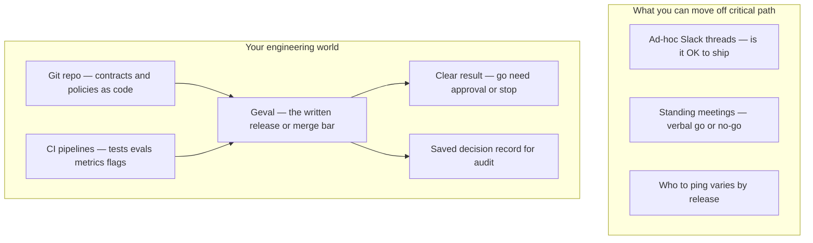
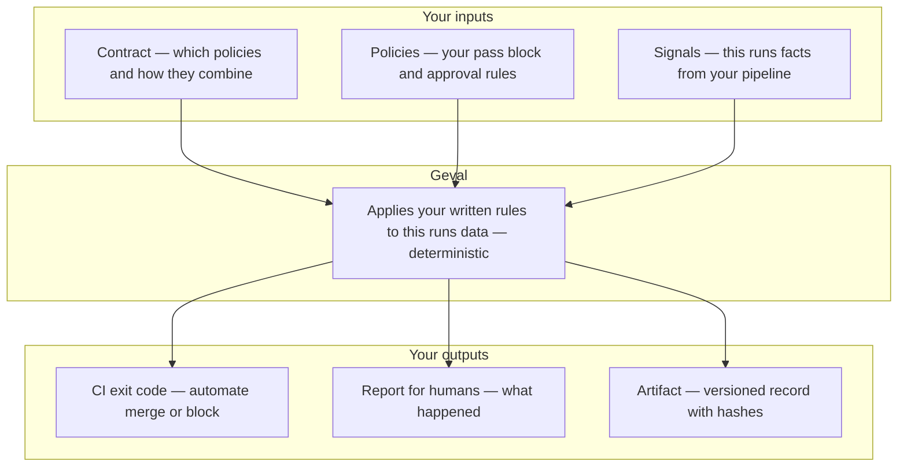
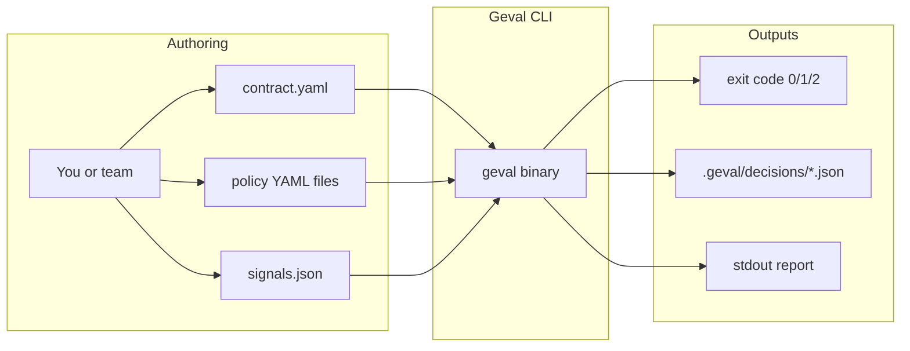
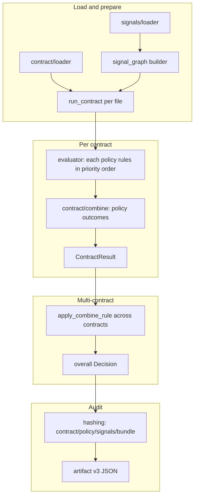
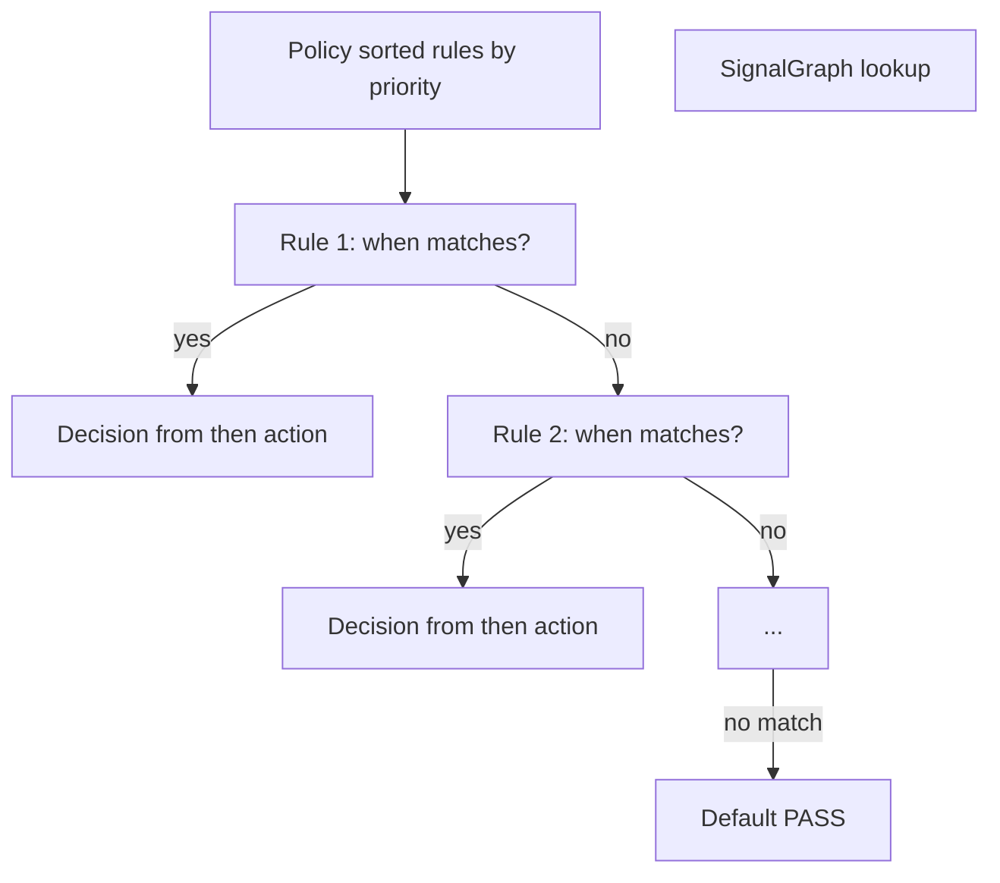
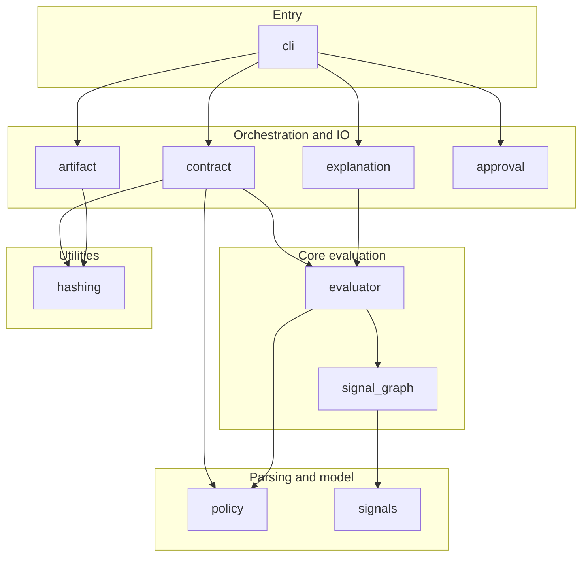

# Geval Architecture

Geval is **contract-centric**: a **contract** is a named, versioned set of **policies** evaluated together with a **combination rule**. Every decision is fully versioned and auditable.

## Customer-facing overview

**What Geval is (one sentence):** You describe **rules** in files; your pipeline feeds **signals** (measurements and flags). Geval applies those rules in a fixed order and gives you **one clear outcome**—go, needs human approval, or stop—plus a **written record** you can keep for audits. It runs **on your machine or in CI**; it does not call the cloud or “decide” with AI.

### How you use it (typical workflow)

1. **Author** a **contract** (which policy files count, and how their results combine) and **policies** (ordered rules: *when* this signal looks like *this*, *then* pass / block / require approval). You can write YAML by hand, use `geval init` for a template, or generate files at **[config.geval.io](https://config.geval.io)**.
2. **Produce** a **signals** JSON file from your eval pipeline, tests, or release process (metrics, scores, presence-only flags—mixed is OK).
3. **Run** `geval check` (locally or in GitHub Actions / your CI) pointing at your contract(s) and signals.
4. **Act** on the **outcome** (merge, hold for review, or fix) and optionally keep the **decision file** Geval writes under `.geval/decisions/` for accountability.

### Replacing informal “can we ship?” with a formal bar

Many teams **decide in Slack** (“any objections?”, “LGTM in thread”) or **in meetings** (“we’re good to go”). That is fast, but it is **hard to repeat**, **hard to audit**, and **easy to drift** (different people, different bars, no link to the actual metrics).

Geval does **not** remove humans when you need them—it **formalizes the bar**:

| Informal (today) | Formal (with Geval) |
|------------------|---------------------|
| Ship discussion scattered across Slack | **Rules live in Git** (reviewed like code, versioned) |
| “We looked at the dashboard” | **Same signals file** produced by CI for every PR or release |
| “I thought Alice approved” | **Require approval** is a named outcome; you can still use `geval approve` with a reason |
| Auditor asks “what was the policy?” | **Decision artifact** ties outcome to rule set and data hashes |

Geval is the **thin layer** that sits between **evidence** (signals) and **policy** (your YAML), in **CI**, so every change runs the **same** check—not a new meeting every time.

### Before vs after: from mixed signals to deploy

**Before:** All kinds of **non-uniform** evidence (scores, flags, presence-only items, business KPIs, per-component metrics) exist in different tools. **Slack** and **meetings** are where people **interpret** that mess, argue, and **eventually agree** on one decision—then you **deploy** (or not).

**After:** The same evidence is **collected into one signals file** per run. **Geval** applies **written rules** in CI, producing **one outcome** every time (pass / require approval / block) and a **record**—then you **deploy** when the bar is met.



**Same story, different middle:** the **middle** stops being “where did we discuss?” and becomes “what did we **encode** and what did Geval **say**?”

### Where Geval sits in your organization (big picture)

This is the stakeholder view: **no internals**, only how Geval fits next to Git, pipelines, and people.



**How to read it:** Slack and meetings can still exist for **design and context**; Geval replaces using them as the **authoritative** gate when you are ready. The **authoritative** bar becomes: *what is merged in Git + what CI measured + what Geval said*.

### One diagram: inputs, Geval as the gate, outputs (black box)

Same flow as the workflow above, but **Geval is a single step**—no engine internals. Use this when explaining mechanics without implementation detail.



**How to read the outcome:** **Pass** → rules allow proceeding. **Require approval** → a rule says a person must sign off (you can formalize that step too). **Block** → do not proceed until the underlying signals or rules change.

---

## Architecture diagrams (technical)

These diagrams are for engineers contributing to or integrating Geval. They render on GitHub and in many Markdown viewers that support [Mermaid](https://mermaid.js.org/).

### High level: what Geval is in your stack

Geval is a **local, deterministic** step: files in → decision + artifact out. No network, no ML.



**Typical placement:** CI (e.g. GitHub Actions) runs `geval check` on a PR; your pipeline produces `signals.json`; policies live in-repo.

### End-to-end: `geval check` (multi-contract)

One **signals** graph is shared. Each **contract file** is loaded, policies evaluated, then outcomes are merged twice: **within** each contract (`combine`), then **across** contracts (`--combine-contracts`).



### Inside one policy: first matching rule wins



### Internal module layers (dependency direction)

Upper layers call lower layers; there are **no** remote calls.



## Core concepts

| Concept | Description |
|--------|-------------|
| **Contract** | YAML file: `name`, `version`, `combine` (rule), and list of policy paths. The unit of evaluation. |
| **Policy** | YAML file: optional `name`/`version`, `environment`, and ordered `rules`. Each rule has `when` (conditions) and `then` (action: pass / block / require_approval). |
| **Signals** | JSON: optional `name`/`version`, and array of signal objects (metric, value, component, etc.). Facts fed into the engine. |
| **Combination rule** | How to merge outcomes from multiple policies/contracts: **`worst_case`** — BLOCK > REQUIRE_APPROVAL > PASS. |

## Data flow

1. **Load contract** – Parse contract YAML; resolve policy paths relative to the contract file; load each policy.
2. **Load signals** – Parse signals JSON; build an in-memory signal graph (metric → value lookup).
3. **Evaluate each policy** – For each policy, **every** rule is checked against the signal graph. **All** matches are recorded; the **winning** rule is the one with the **best** priority (**1** = highest; larger numbers are lower). That rule’s action is the policy outcome (PASS / REQUIRE_APPROVAL / BLOCK). **Priorities must be unique** within a policy (validated at load).
4. **Combine (policies)** – Apply **`worst_case`** merging to the list of policy outcomes → one combined decision **per contract**.
5. **Combine (contracts)** – If multiple contract files are passed (`geval check -c a.yaml -c b.yaml`), apply **`--combine-contracts`** (same **`worst_case`** semantics) to each contract’s combined outcome → one **overall** PR-level decision.
6. **Artifact** – Write `.geval/decisions/<timestamp>.json` (v4) with `bundle_hash`, each contract block, `contracts_combine_rule`, per-policy `matching_rules`, and overall outcome + hashes.

## Module layout

```
geval/src/
  contract/       # Contract = multiple policies + combine rule
    model.rs      # ContractDef, PolicyRef
    combine.rs    # CombineRule (worst_case), apply_combine_rule
    loader.rs     # load_contract, load_contract_and_policies, parse_contract_str
    runner.rs     # run_contract, load_run_contracts → ContractResult / MultiContractRun
  policy/         # Single policy model and parser
    model.rs      # Policy, Rule, RuleCondition, RuleConsequence, Action, Operator
    parser.rs     # parse_policy, parse_policy_str
  evaluator/      # Single-policy evaluation
    engine.rs     # evaluate(policy, graph) → Decision; evaluate_with_trace
  signal_graph/   # Build lookup from signals for rule matching
  signals/        # Load signals JSON (name, version, signals array)
  hashing/        # SHA256 for contract, policy, signals, contract bundle (audit)
  artifact/       # write_multi_contract_artifact (v4: multi-contract + overall)
  explanation/    # explain_contract_result, explain_multi_contract_result, explain_decision
  approval/       # Approval/rejection artifact (versioned)
  cli/            # Commands: check, init, demo, explain, validate-contract, approve, reject
```

## Invariants

- **Nothing unversioned** – Contract, policies, and signals have name/version; artifact records them and hashes.
- **Deterministic** – Same contract set (order) + same signals → same overall decision.
- **No remote calls** – All inputs and outputs are local files.

## Adding a new combination rule

1. Add a variant to `CombineRule` in `contract/combine.rs`.
2. Implement the logic in `apply_combine_rule` (match on the new variant).
3. Add `Serialize`/`Deserialize` (and `FromStr`/`Display` if you want CLI/artifact string).
4. Add tests in `contract/combine::tests`.
5. Document in [signals-and-rules.md](signals-and-rules.md) or [versioning.md](versioning.md).

See [extending.md](extending.md) for the full change process.
